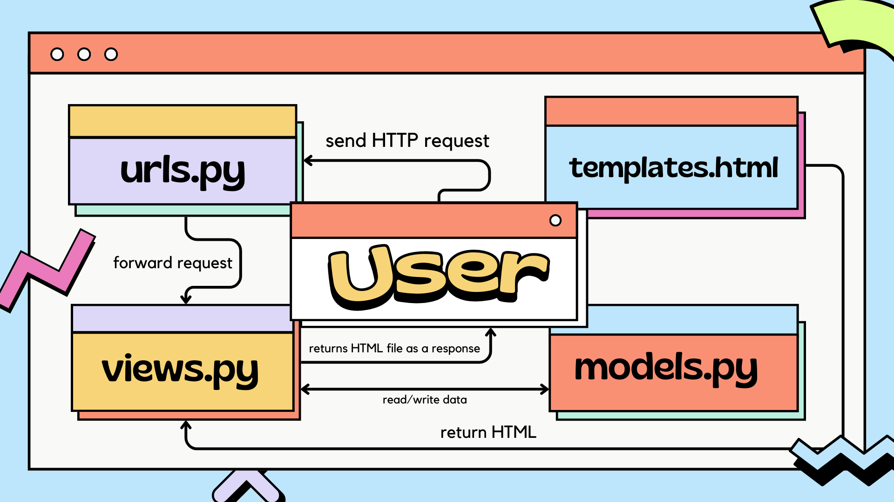
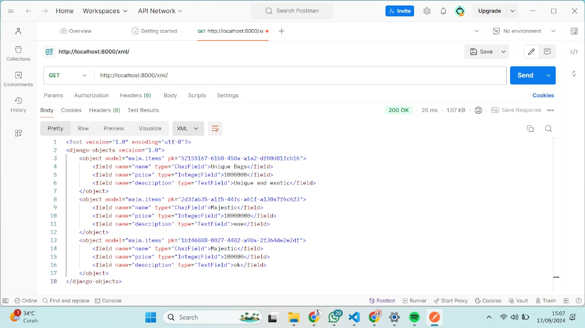
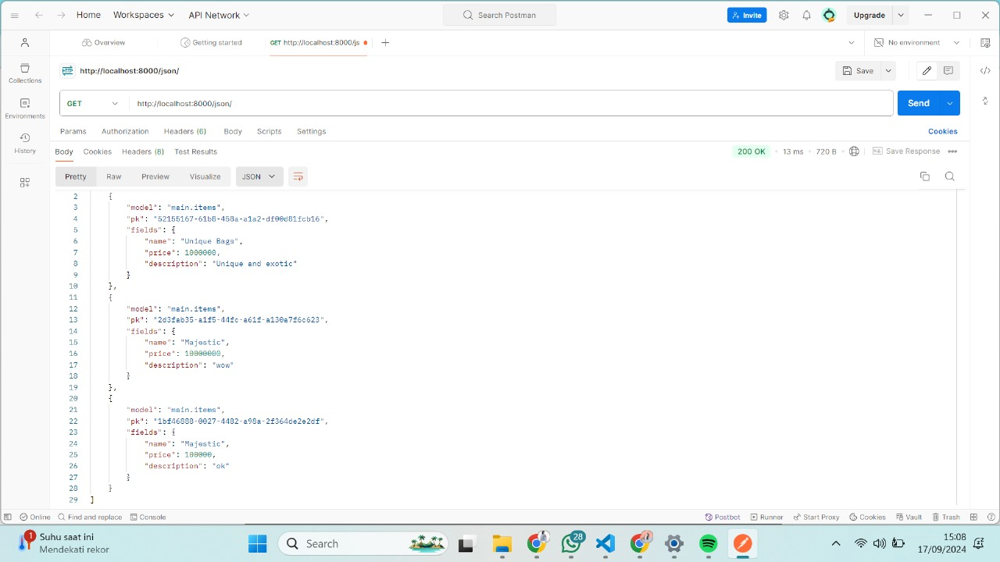
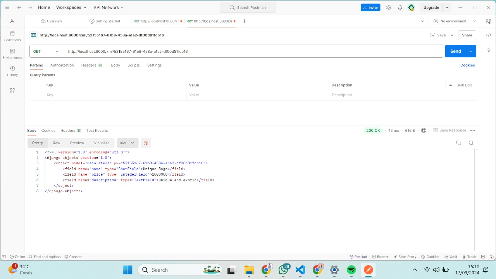
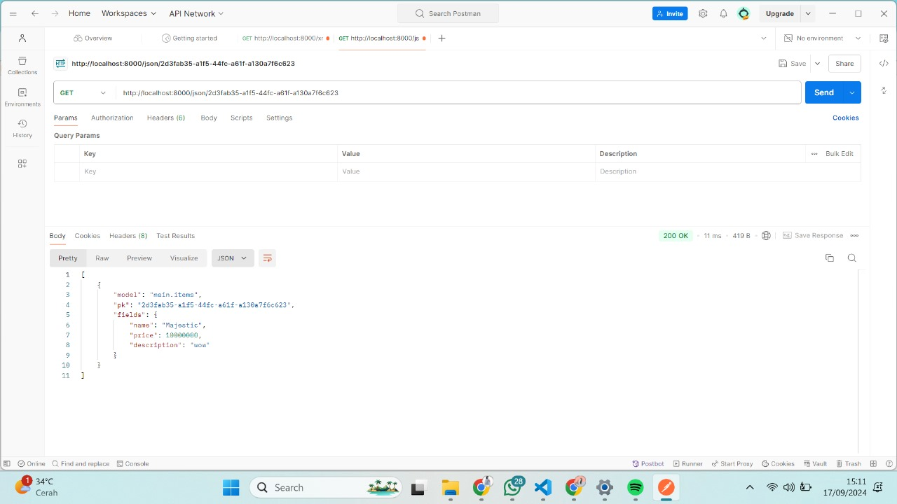

Nama : Rebecca Zaneta Octoria Hutajulu
NPM : 2306275065
Kelas : PBP-E

# TUGAS 2

## 1. Implementasi Checklist Step-by-Step:

- **Buat Direktori Proyek**  
  Buat direktori proyek bernama `exotique` dan install dependencies termasuk Django.

- **Buat Proyek Django**  
  Jalankan perintah `django-admin startproject [nama_project]` untuk membuat proyek baru.

- **Buat Aplikasi**  
  Jalankan `python manage.py startapp main` untuk membuat aplikasi bernama `main`.

- **Konfigurasi Routing**  
  Di dalam direktori `main`, buat file `urls.py` dan tambahkan URL yang diinginkan.

- **Tambahkan Model**  
  Tambahkan model sesuai kebutuhan di `models.py` dan gunakan tipe data yang sesuai (seperti `CharField` atau `IntegerField`).

- **Migrasi Model**  
  Jalankan perintah `python manage.py makemigrations` dan `python manage.py migrate` untuk membuat dan menerapkan migrasi model.

- **Fungsi di `views.py`**  
  Buat fungsi di `views.py` yang mengembalikan template HTML yang menampilkan nama aplikasi serta nama dan kelas.

- **Hubungkan URL ke Views**  
  Buat routing di `urls.py` aplikasi `main` untuk menghubungkan URL dengan fungsi di `views.py`.

- **Deployment ke PWS**  
  Lakukan deployment ke PWS untuk membuat aplikasi dapat diakses secara online.

## 2. Bagan Alur Request dan Response Django

## 3. Fungsi Git dalam Pengembangan Perangkat Lunak

Git merupakan sistem kontrol yang berfungsi untuk melacak perubahan dalam kode utama selama pengembangan perangkat lunak.

## 4. Kenapa Django Cocok untuk Pemula?

- **Struktur Terorganisir**: Django mempunyai struktur yang terorganisir dan jelas, sehingga pemula bisa mudah memahami alur pengembangan aplikasi

- **Framework Lengkap**: Django menyediakan framework yang lengkap, sehingga pemula tidak harus membangun semuanya dari awal.

## 5. Alasan Model di Django Disebut ORM

Pada Django, model disebut sebagai **ORM (Object-Relational Mapping)** karena menyediakan lapisan abstraksi yang menghubungkan objek Python dengan tabel di database relasional. Ini memungkinkan pengguna berinteraksi dengan database menggunakan kode Python tanpa perlu menulis SQL secara manual.

---

# TUGAS 3

## 1. Pentingnya Data Delivery

Data delivery diperlukan untuk memastikan bahwa data dapat dikirimkan, diterima, dan diakses pengguna dan sistem lain. Hal ini membantu pengguna cepat membuat keputusan berdasarkan data dan menjadikan platform mudah dan cepat untuk digunakan. Data delivery juga membantu menjaga informasi tetap sinkron, menjaga data tetap sama, dan mendukung aktivitas utama seperti menganalisis, memeriksa, dan membiarkan orang atau sistem berbicara satu sama lain.

## 2. JSON vs XML

- **JSON** lebih sederhana, ringan, dan mudah ditangani dibanding XML, dengan sintaks lebih ringkas, ukuran lebih kecil, dan lebih cepat dipahami web. JSON populer karena kompatibel dengan JavaScript, mendukung tipe data modern, dan mudah digunakan di layanan web seperti REST
- **XML** digunakan untuk kasus khusus yang butuh pemeriksaan detail.

## 3. Fungsi Method `is_valid()` pada Form Django

Method `is_valid()` digunakan untuk memeriksa apakah data yang dimasukkan ke dalam form valid. Method ini mengembalikan `True` jika data valid dan `False` jika tidak. Method ini sangat penting untuk mengecek apakah data yang dimasukkan akurat dan aman sebelum digunakan/disimpan

## 4. Pentingnya `csrf_token` di Form Django

`csrf_token` digunakan untuk mencegah serangan **Cross-Site Request Forgery (CSRF)**, di mana penyerang dapat memaksa pengguna untuk melakukan tindakan tanpa izin. Token ini memverifikasi bahwa permintaan form berasal dari sumber yang valid, menjaga keamanan aplikasi.

## 5. Implementasi Checklist Step-by-Step

- Saya memulai dengan membuat folder `templates` dan mengisinya dengan base template.
- Mengonfigurasi `templates` di `settings.py`.
- Menambahkan UUID di `models.py` untuk ID yang lebih aman.
- Melakukan migrasi dengan `makemigrations` dan `migrate`.
- Membuat file `forms.py` dan mendefinisikan `ItemsEntryForm`.
- Menambahkan fungsi `create_item_entry` di `views.py` untuk menambahkan item secara otomatis ketika form disubmit.
- Mengubah fungsi `show_main` untuk menampilkan semua objek dari database di halaman utama.
- Membuat template `create_item_entry.html` dan menghubungkan URL di `urls.py`.
- Menambahkan fungsi `show_xml`, `show_json`, `show_xml_by_id`, dan `show_json_by_id` di `views.py`.
- Memperbarui `urls.py` dengan path untuk fungsi tersebut.

## 6. Screenshots
- XML Data  
  
- JSON Data  
  
- XML by ID  
  
- JSON by ID  
  

---

# TUGAS 4  

## 1. Perbedaan antara HttpResponseRedirect() dan redirect()
- HttpResponseRedirect(): Merupakan respon HTTP standar yang mengarahkan pengguna ke URL tertentu
- redirect(): Fungsi shortcut Django yang lebih fleksibel, bisa mengarahkan ke URL, nama view, atau bahkan objek, dan Django akan otomatis memprosesnya ke URL yang sesuai.

## 2. Jelaskan cara kerja penghubungan model Product dengan User!
Untuk menghubungkan model Product dengan User di Django, kita bisa menggunakan ForeignKey. Di models.py, tambahkan field `user = models.ForeignKey(User, on_delete=models.CASCADE)` pada class Product, yang menunjukkan bahwa setiap produk terkait dengan satu instance User. Dengan begitu, saat produk dibuat, kita bisa mengidentifikasi pengguna yang membuatnya dan mengelola produk tersebut melalui hubungan ini. Relasi ini mempermudah akses ke data yang terkait, seperti menampilkan produk yang dimiliki oleh seorang pengguna tertentu atau menentukan pengguna mana yang memiliki akses ke suatu produk.

## 3. Apa perbedaan antara authentication dan authorization, apakah yang dilakukan saat pengguna login? Jelaskan bagaimana Django mengimplementasikan kedua konsep tersebut.
- Authentication : proses memverifikasi identitas user, biasanya dengan memeriksa kecocokan antara username dan password. 
- Authorization : proses menentukan hak akses user setelah berhasil diautentikasi, yaitu apa saja yang boleh dan tidak boleh dilakukan dalam aplikasi. 
Ketika pengguna login, sistem akan memvalidasi kredensial mereka melalui proses authentication. Django menyediakan kedua konsep ini melalui sistem autentikasi bawaan yang mendukung mekanisme login, logout, dan manajemen sesi untuk authentication. Untuk authorization, Django menggunakan sistem izin (permissions), grup pengguna, serta decorator seperti @login_required untuk mengatur akses ke berbagai bagian aplikasi berdasarkan hak yang diberikan kepada pengguna.

## 4. Bagaimana Django mengingat pengguna yang telah login? Jelaskan kegunaan lain dari cookies dan apakah semua cookies aman digunakan?
Django mengingat pengguna yang sudah login melalui sistem sesi yang menggunakan cookies. Setelah login, Django membuat sesi unik dan menyimpan ID sesi dalam cookie di browser. Setiap kali pengguna mengakses server, cookie ini dikirim kembali untuk mengidentifikasi pengguna yang sudah login. Selain autentikasi, cookies juga digunakan untuk menyimpan preferensi, melacak aktivitas, dan mengelola konten. Namun, cookies bisa rentan terhadap serangan seperti XSS, sehingga penting untuk menggunakannya dengan aman menggunakan atribut seperti HttpOnly dan Secure serta menghindari menyimpan informasi sensitif.

## 5. Jelaskan bagaimana cara kamu mengimplementasikan checklist di atas secara step-by-step 
- Buat halaman **register.html** dan **login.html** di `templates` (main) untuk menampilkan form registrasi dan login.
- Implementasikan form registrasi dengan mengimpor **UserCreationForm** dan **messages** di `views.py` untuk menampilkan pesan keberhasilan saat user dibuat.
- Buat fungsi **register** di `views.py` untuk merender halaman registrasi (`register.html`).
- Buat fungsi login dengan mengimpor **authenticate** dan **login**, serta buat fungsi **login_user** untuk merender halaman login (`login.html`).
- Tambahkan fungsi **logout_user** di `views.py`, menggunakan **logout**, untuk mengarahkan user kembali ke halaman login setelah logout.
- Tambahkan tombol **logout** di `main.html` yang memanggil fungsi **logout_user** untuk logout user.
- Gunakan decorator **@login_required** pada fungsi **show_main** agar user harus login sebelum mengakses halaman utama.
- Konfigurasi semua fungsi di **urls.py** dengan menambahkannya ke dalam **urlpatterns** untuk mengaktifkan fungsi-fungsi tersebut.
- Jalankan program dan lakukan percobaan pendaftaran user baru dengan form registrasi.
- Atur **cookie** saat fungsi **login_user** dijalankan dan hapus cookie saat user logout untuk melacak kapan user terakhir login.
- Tampilkan informasi login terakhir di halaman **show_main** dan render di **main.html**.
- Hubungkan model **Product** dengan **User** di `models.py` menggunakan **ForeignKey**, dengan mengimpor model **User**.
- Modifikasi fungsi **create_item_entry** di `views.py` untuk mengaitkan item dengan user yang login sebelum menyimpannya ke database.
- Filter produk yang ditampilkan di **show_main** berdasarkan user yang sedang login.
- Lakukan **migrations** setelah perubahan, impor **os**, dan sesuaikan variabel **DEBUG** di `settings.py` agar siap untuk environment production.

